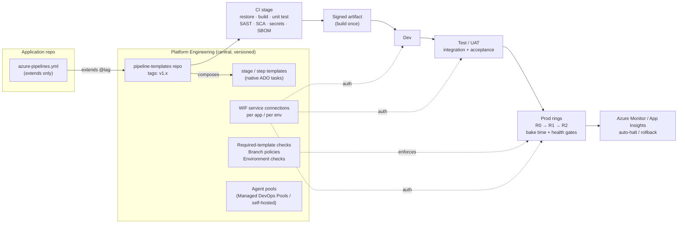

# Classic → YAML Pipeline Migration: What Good Looks Like

> **Page info**
> | | |
> |---|---|
> | **Owner** | Platform Engineering |
> | **Status** | DRAFT – for review |
> | **Scope** | Target state for ~3,650 Azure DevOps classic build & release pipelines moving to YAML |
> | **Last updated** | 2026-10-07 |

---

## 1. TL;DR

- Every migrated pipeline lands on a **small set of paved-road templates** — not a 1:1 copy of the classic definition.
- "Good" = **one thin YAML file per repo** that `extends` a **centrally-owned, pinned Azure DevOps YAML template** built entirely from **native Azure DevOps tasks**.
- Guardrails are **enforced by the platform, not by documentation**: required-template checks on protected resources, Environments with approvals/checks, Workload Identity Federation (no secrets), pinned template versions.
- Production rollout follows the pattern Microsoft, Meta, GitHub and Netflix use: **build once → progressive exposure → automated health signals → automatic halt/rollback**.

---

## 2. What the industry leaders do

The table below summarises **publicly documented** practices. Most of their tooling is internal; we adopt the **principles**, implemented with Azure DevOps (and later GitHub) primitives.

| Organisation | Documented practice | Source | What we adopt |
|---|---|---|---|
| **Microsoft** | **Safe deployment practices**: tiered/ring rollout (internal → small → medium → all), **bake time** (~24h incl. peak usage), expedited hotfix rules by severity, same tooling in dev/test/prod, deploy during working hours, zero-downtime mindset | [Safe deployment practices](https://learn.microsoft.com/en-us/devops/operate/safe-deployment-practices) | Environment tiers + bake-time checks; severity-based hotfix path |
| **Microsoft** | **`extends` templates as a security boundary**; enforce with **required-template checks** on protected resources; pin templates to a tag; type-safe parameters; inject mandatory steps (e.g., credential scanning) | [Templates for security](https://learn.microsoft.com/en-us/azure/devops/pipelines/security/templates?view=azure-devops) | Central template repo, required-template checks on prod service connections/environments |
| **Microsoft** | Baseline: PR pipeline → CI pipeline → CD with staging + acceptance tests + prod smoke tests; prefer YAML over Classic; templates for reuse | [Azure Pipelines baseline architecture](https://learn.microsoft.com/en-us/azure/devops/pipelines/architectures/devops-pipelines-baseline-architecture?view=azure-devops) | Pipeline stage anatomy (Section 5) |
| **GitHub** | **Reusable workflows** in a central repo ("paved paths with built-in guard rails"), **required workflows** at org scope, OIDC (no stored cloud secrets), least-privilege tokens, allow-listing of actions | [Org-wide governance & re-use for CI/CD](https://github.blog/enterprise-software/devops/building-organization-wide-governance-and-re-use-for-ci-cd-and-automation-with-github-actions/) | Same model in ADO now; maps 1:1 to GitHub reusable/required workflows later |
| **GitHub** | Deploys github.com tens of times a day (incl. Fridays); **instruments the pipeline itself** (build duration, step duration, rollback count, retries); **SLOs on deployment** speed/reliability; dedicated deployment team | [Deployment reliability at GitHub](https://github.blog/engineering/engineering-principles/deployment-reliability-at-github/) | Pipeline telemetry + SLOs owned by Platform team |
| **Meta** | Moved from weekly/cherry-pick releases to **quasi-continuous "push from master"**; each release goes **employees → 2% → 100%** with push-blocking alerts and an emergency stop; features hidden behind **Gatekeeper** (feature flags) to decouple deploy from release; strong central release-engineering team | [Rapid release at massive scale](https://engineering.fb.com/2017/08/31/web/rapid-release-at-massive-scale/) | Small batches, ring rollout, feature flags (Azure App Configuration), central release engineering |
| **Netflix (+Google)** | **Automated canary analysis** (Kayenta in Spinnaker): canary vs fresh baseline, statistical judgement on chosen metrics, score → **auto-promote / human review / auto-rollback** | [Introducing Kayenta](https://cloud.google.com/blog/products/gcp/introducing-kayenta-an-open-automated-canary-analysis-tool-from-google-and-netflix) | Azure Monitor–based health gates on Environments; canary for AKS/Container Apps tier-1 services |

### Common patterns across all four

1. **Paved road, centrally owned** – a platform team owns the golden path; app teams consume it.
2. **Guardrails enforced by the system** – not by wiki pages or reviews.
3. **Small batches, deployed often** – risk is proportional to change size.
4. **Progressive exposure** – rings/canaries with bake time.
5. **Automated health judgement** – metrics decide promotion/rollback, humans handle the marginal cases.
6. **Decouple deploy from release** – feature flags.
7. **Measure the delivery system itself** – SLOs/DORA on pipelines, not just apps.

---

## 3. Principles – what good looks like

| # | Principle | Concretely means |
|---|---|---|
| P1 | **Pipelines are code** | YAML in the app repo, PR-reviewed, versioned. No classic/UI-defined pipelines. |
| P2 | **Thin pipeline, fat templates** | App YAML ≈ 10–20 lines `extends`; all stages/jobs/steps live in central templates built from native ADO tasks (`DotNetCoreCLI`, `AzureWebApp`, `AzureCLI`, …); no per-repo inline script logic. |
| P3 | **Build once, promote everywhere** | One immutable, versioned artifact promoted dev → test → prod. Never rebuild per environment. |
| P4 | **Enforced, not advised** | Required-template checks on prod service connections & environments; branch policies on `main`. |
| P5 | **No long-lived secrets** | Workload Identity Federation service connections; Key Vault–linked variable groups; per-app, per-env identities (least privilege). |
| P6 | **Secure supply chain** | Templates pinned to tags; SAST/SCA/secret scanning; SBOM; signed artifacts/images. |
| P7 | **Progressive delivery** | Slots (App Service/Functions), canary/blue-green (AKS/ACA); bake time; automated health gates; auto-rollback. |
| P8 | **Environments are the control plane** | Approvals, business-hours, exclusive lock, Azure Monitor alert checks live on the Environment — not inside YAML. |
| P9 | **Infra follows the same rules** | Bicep: lint → build → what-if → approval → deploy, same template model. |
| P10 | **Observable delivery** | Every run stamps app version + template version; deployments visible per Environment; smoke tests after every deploy. |

---

## 4. Target architecture



> If the Confluence Mermaid macro isn't available, paste the diagram into a draw.io/Gliffy page.

---

## 5. Pipeline anatomy (the paved road)

### 5.1 Repository layout

```
app-repo/
├── azure-pipelines.yml        # thin: extends org template
├── infra/                     # Bicep (main.bicep + <env>.parameters.json)
└── src/ ...
```

### 5.2 App pipeline (everything a team writes)

```yaml
resources:
  repositories:
    - repository: templates
      type: git
      name: Platform/pipeline-templates
      ref: refs/tags/v1.0.0          # pinned to a tag, never a branch

extends:
  template: app/dotnet-webapp.yml@templates
  parameters:
    appName: orders-api
    solution: src/Orders.sln
    publishProject: src/Orders.Api/Orders.Api.csproj
    dotnetVersion: '8.x'
    environments: [dev, test, prod]
    slotEnvironments: [prod]
```

### 5.3 What the org template guarantees (not overridable)

| Stage | Mandatory content |
|---|---|
| **PR validation** | Build, unit test, lint, SAST, SCA, secret scan, code coverage publish |
| **CI (main)** | All of the above + integration tests, SBOM, versioning, signed artifact publish |
| **Deploy (per env)** | `deployment` job bound to an **Environment**; WIF connection; Bicep what-if before apply; smoke test |
| **Prod** | Ring rollout, bake time, Azure Monitor alert gate, auto-rollback / slot swap-back |
| **Always** | Template version stamped on run, artifact provenance |

### 5.4 Template catalogue (initial)

| Template | Covers | Notes |
|---|---|---|
| `app/dotnet-webapp` | .NET → App Service / Functions | Expected largest share |
| `app/dotnet-library` | NuGet packages | Publishes to Azure Artifacts |
| `app/node-webapp` | Node/SPA → App Service / Static Web Apps | |
| `app/container` | Docker → ACR → AKS / Container Apps | Canary-capable |
| `app/java-maven`, `app/python` | Long tail | |
| `infra/bicep` | Bicep deployments | what-if + approval |
| `infra/terraform` | Terraform (where present) | plan + approval |
| `ops/powershell` | Scripted ops jobs | Restricted; time-boxed exception path |

### 5.5 Template repo layout

```
pipeline-templates/
├── app/                       # extends entry points (one per app type)
│   └── dotnet-webapp.yml
├── infra/
│   └── bicep.yml
├── stages/                    # build-dotnet, deploy-webapp, build-bicep, deploy-bicep
├── steps/                     # stamp-run, security-scan, sbom, smoke-test
├── variables/                 # platform.yml (template version)
└── examples/                  # sample app/infra azure-pipelines.yml
```

### 5.6 Template design rules

| Rule | Why |
|---|---|
| App pipelines may only `extends` an `app/*` or `infra/*` entry point | Single, enforceable boundary (required-template check) |
| All parameters are **typed** with `values:` allow-lists where possible (pools, environments, runtimes) | Prevents arbitrary input; self-documenting |
| Security/compliance steps are injected by the template, not passed in by the caller | Cannot be removed by app teams |
| Build stage produces **one** artifact; deploy stages only consume it | Build once, promote everywhere |
| Every deploy is a `deployment` job targeting an **Environment** | Approvals/checks/history live on the Environment |
| Service connections referenced by **name convention** (`<app>-<env>-wif`), never passed freely | Least privilege, per app/env |
| No secrets in YAML or pipeline variables; Key Vault–linked variable groups only | No secret sprawl |
| Escape hatches (`preBuildSteps`, `postDeploySteps`) are `stepList` params, run **after** mandatory steps | Flexibility without bypassing guardrails |
| Same template used for PR, CI and CD (conditions on `Build.Reason` / branch) | One definition, no drift between PR and CI |
| Prefer native ADO tasks over inline scripts; keep any `pwsh` steps small and inside templates | Readable, supported, auditable |

> Implemented in `lightcli/templates/` (`app/dotnet-webapp.yml`, `infra/bicep.yml` + shared stages/steps).

---

## 6. Guardrails & governance

| Control | Where configured | Enforced by | Purpose |
|---|---|---|---|
| Required template check | Prod service connections, prod environments, agent pools | Azure DevOps checks | Pipelines that don't `extends` the org template **cannot** deploy to prod |
| Branch policies on `main` | Repos (org-wide policy) | Azure Repos | PR + build validation + min reviewers |
| Environment approvals & checks | Environments | Azure DevOps | Approvals, business hours, Azure Monitor alerts, exclusive lock |
| Disable classic pipeline creation | Org settings → Pipelines | Azure DevOps | Stop the bleed |
| WIF-only service connections | Project settings | Policy + audit script | No stored secrets |
| Template version pinning | App YAML | Pipeline review | Predictable, reviewable upgrades |
| Script/step restrictions | Inside `extends` template | Template logic | Block unapproved inline scripts where needed |

---

## 7. Checklist — a pipeline is "good" when

- [ ] YAML in repo, `extends` org template at a pinned tag
- [ ] Triggers, schedules and path filters verified (**classic schedules use org time zone; YAML schedules are UTC**)
- [ ] No inline secrets; secrets only via Key Vault–linked variable groups
- [ ] Task groups replaced with central template steps
- [ ] Service connection is WIF, scoped per app/env
- [ ] Every deploy targets an Environment with approvals/checks matching (or improving) classic release gates
- [ ] Single artifact built once and promoted through all environments
- [ ] Security scans, SBOM and smoke tests run (injected by template)
- [ ] Prod deploy uses slots/rings with a health gate and a rollback path

---

## 8. References

- Microsoft – [Azure Pipelines baseline architecture](https://learn.microsoft.com/en-us/azure/devops/pipelines/architectures/devops-pipelines-baseline-architecture?view=azure-devops)
- Microsoft – [Safe deployment practices](https://learn.microsoft.com/en-us/devops/operate/safe-deployment-practices)
- Microsoft – [Templates for security (extends, required templates)](https://learn.microsoft.com/en-us/azure/devops/pipelines/security/templates?view=azure-devops)
- Microsoft – [Migrate your Classic pipeline to YAML](https://learn.microsoft.com/en-us/azure/devops/pipelines/migrate/from-classic-pipelines?view=azure-devops)
- GitHub – [Building organization-wide governance and re-use for CI/CD](https://github.blog/enterprise-software/devops/building-organization-wide-governance-and-re-use-for-ci-cd-and-automation-with-github-actions/)
- GitHub – [Deployment reliability at GitHub](https://github.blog/engineering/engineering-principles/deployment-reliability-at-github/)
- Meta – [Rapid release at massive scale](https://engineering.fb.com/2017/08/31/web/rapid-release-at-massive-scale/)
- Google & Netflix – [Introducing Kayenta: automated canary analysis](https://cloud.google.com/blog/products/gcp/introducing-kayenta-an-open-automated-canary-analysis-tool-from-google-and-netflix)
- Spinnaker – [Automated Canary Analysis guide](https://spinnaker.io/docs/guides/user/canary/)
